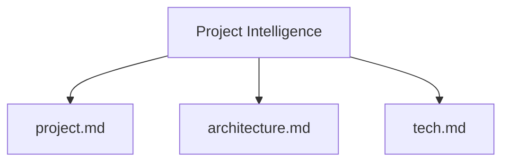

# Project Intelligence

# Amazon Q Developer Project Intelligence

## Guidelines

- Before writing the documentation, ask all relevant questions to understand the context of this codebase.
- The documentation must be specific with a focus on simplicity and clearance.
- Write documentation in prose.
- Prevent repetitions and ambiguity in the documentation.

## Project Intelligence Structure

The Project intelligence consists of required core files and optional context files, all in Markdown format. It is located in `./.amazonq/project-intelligence` folder.
Files build upon each other in a clear hierarchy:

### Required Core Files

1. `project.md`
   - Source of truth for project and business scope. Explains the product vision, features, core requirements, goals and target users.
   - Outlines customer problems being solved and how the product helps to solve the problems of the users.
   - Visualize user journeys using the user journey mermaid syntax.
   - Describes current state of development based on open issues, and the product backlog.

2. `architecture.md`
   - Source of truth for software architecture and software design.
   - Describes system architecture and design patterns.
   - Documents key architecture decisions.
   - Visualize the software architecture using the architecture mermaid syntax.
   - Describes data models, database schemas and APIs.
   - Visualize data models using the entity-relationship-diagram mermaid syntax.
   - Use sequence diagrams in mermaid syntax to visualize processes and interactions between components.

3. `tech.md`
   - Explains the project's directory structure and code organization.
   - Documents the tech stack, technologies, and development tools used.
   - Includes listing of packages and dependencies.

### Additional Context

Create additional files/folders within `./.amazonq/project-intelligence` when they help organize:

- Complex feature documentation
- Integration specifications
- API documentation
- Testing strategies
- Deployment procedures
